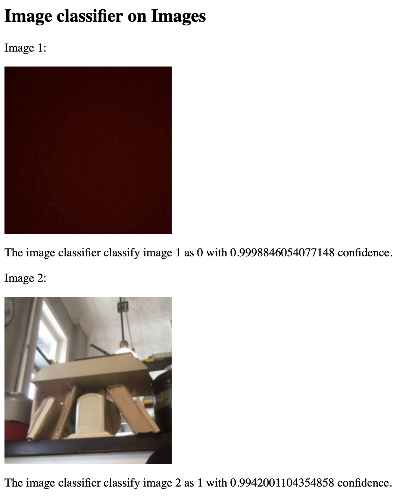
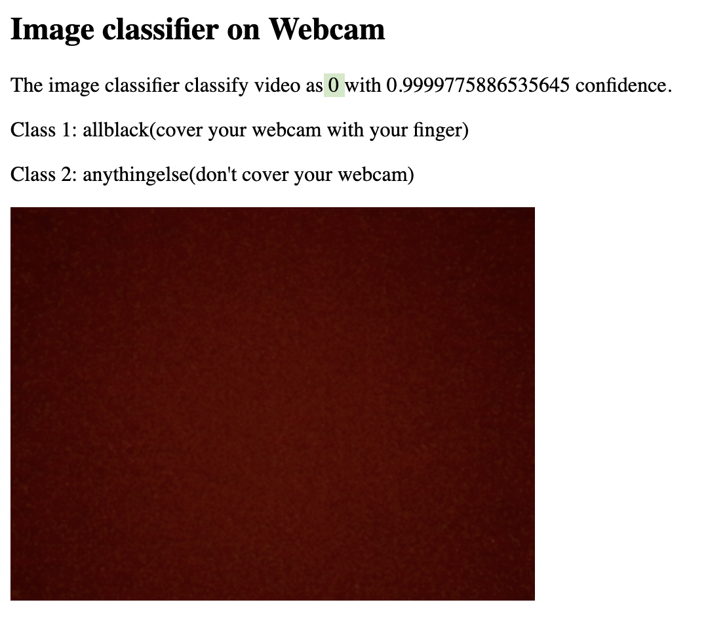
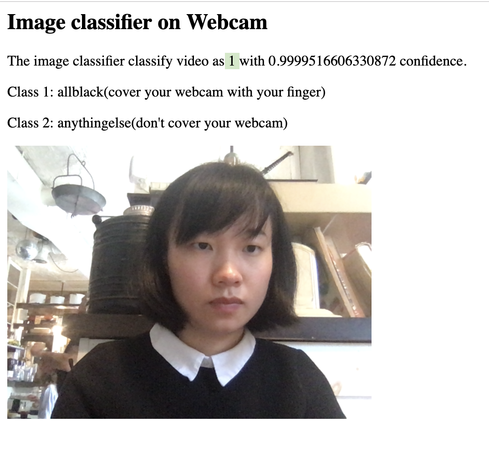
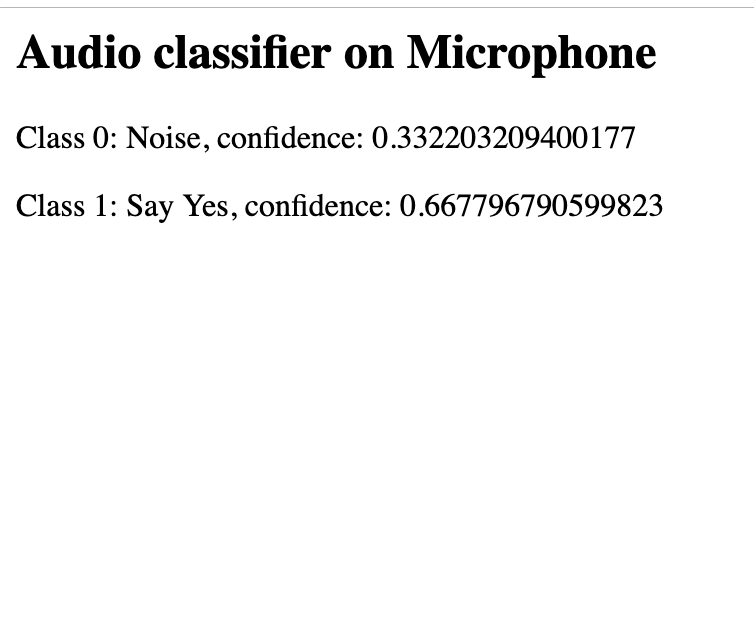
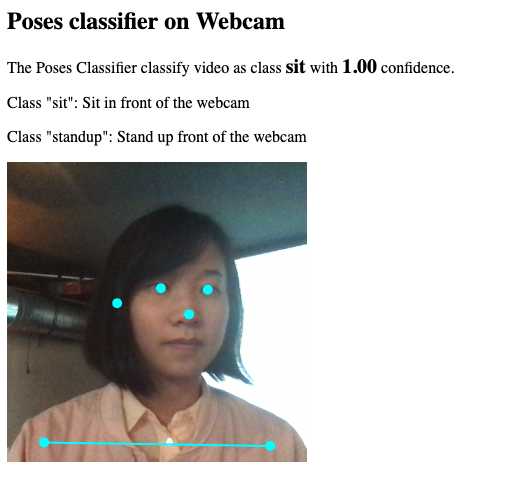
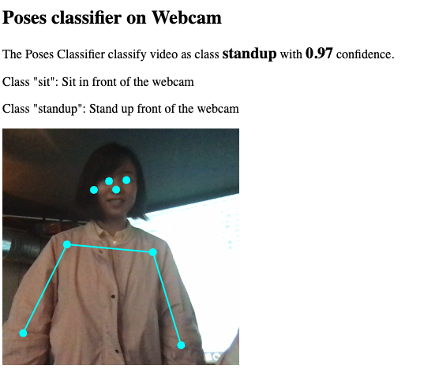

# Teachable Machine + p5.js
This repo holds a few basic [p5.js](http://p5js.org) examples that uses the models trained with Google's [teachable machine prototype](https://teachablemachine.withgoogle.com/io19).

## List of examples
Here are examples of image, audio, and pose classifier.
- Image classifier
  - Image classifier on images
  - Image classifier on webcam
  - Image classifier with a lamp
- Audio classifier
  - Audio classifier on the microphone
- Poses classifier
  - Poses classifier on webcam

## Demo
- Image classifier on images demo:
  [Try it live](https://yining1023.github.io/teachable-machine-p5/imageclassifier/imageclassifier-on-images/)<br/>
  <kbd></kbd>
  
- Image classifier on webcam demo:
  [Try it live](https://yining1023.github.io/teachable-machine-p5/imageclassifier/imageclassifier-on-webcam/)<br/>
  <kbd></kbd><kbd></kbd>

- Audio classifier on the microphone demo:
  [Try it live](https://yining1023.github.io/teachable-machine-p5/audioclassifier)<br/>
  <kbd></kbd>

- Poses classifier on the webcam demo:
  [Try it live](https://yining1023.github.io/teachable-machine-p5/poseclassifier/poseclassifier-on-webcam/)<br/>
  <kbd></kbd><kbd></kbd>

## Get started
Go to your terminal:
```
$ git clone https://github.com/yining1023/teachable-machine-p5.git
$ cd teachable-machine-p5
$ python -m SimpleHTTPServer     # $ python3 -m http.server (if you are using python 3)
```
Go to `localhost:8000` in your browser, you will see a directory list like this:
- audioclassifier/
- imageclassifier/
- poseclassifier/
- README.md

Click into each folder, you will see the examples.

## More Teachable Machine Prototype + p5.js Projects!
- [Your full name](Your portfolio link/twitter/Instagram/any link you like), [Project name](Your blog link with images/videos), Project short description, [Live demo](optional, live demo link)
- Khensu-Ra [Inevitable](https://github.com/Khensura21/ml4w-hw/tree/master/final)
- Caleb - [Screen Locker](https://github.com/calebsavage/machine-learning-for-web/tree/master/week3)
- Daniel - [Create your GUI with OSCAR](https://docs.google.com/presentation/d/1JTMhAxybXksrZHRMRJnUGdRB3KBwzd7ZJ21MVGX2mRo/edit?usp=sharing)
- Dylan - [Move the Little Dude](https://dylandawkinsblog.wordpress.com/2019/05/08/machine-learning-for-web-final/), Use hand gestures to move a character.
- Eva - [link](https://www.evaphilips.com/machine-learning-for-the-web/2019/5/8/week-6-7-final-project)
- Vince - [Vince MingPu Shao](https://www.vinceshao.com/), [Teachable Snake](https://www.vinceshao.com/works/teachable-snake), Teachable Snake is a classic snake game controlled by webcam image, powered by Tensorflow.js and Teachable Machine by Google, using pre-trained neural network models., [Live demo](https://teachable-snake.netlify.com/)
- Eva Philips, [Mood Agent](https://www.evaphilips.com/machine-learning-for-the-web/2019/4/13/week-3-mood-agent), Keep the ball afloat by saying the word "Happy"
- Caleb Savage, [Screen Locker](https://calebsavage.github.io/ml4w-week3/) Obscure the web page when the camera can't recognize my face.
- Dylan, [Duet Machine](https://dylandawkinsblog.wordpress.com/2019/04/17/duet-machine/), Tired of singing duets alone? Try this machine!
